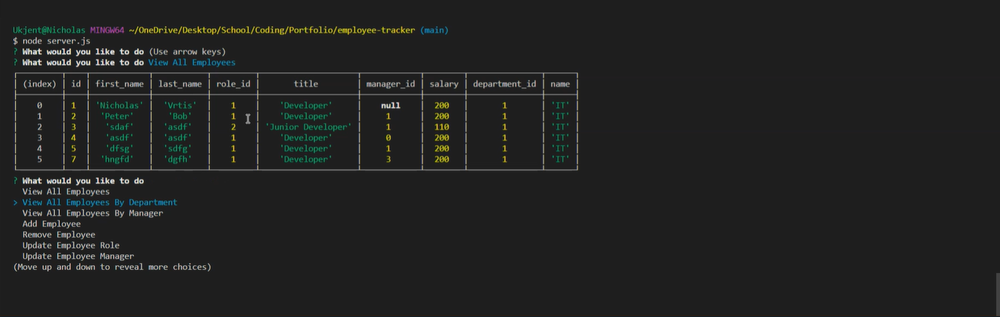

# employee-tracker

  

  [Link to Video](https://youtu.be/JBV-IEkRH8E)
  
 Developers are often tasked with creating interfaces that make it easy for non-developers to view and interact with information stored in databases. Often these interfaces are known as Content Management Systems.
    
  ## Table of Content
  [-Installation](#Installation)  
  [-Description](#Description)    
  [-Usage](#Usage)    
  [-Questions](#Questions)  
  
  
  ## Installation  
  To make this project run on their server/local host. The user needs to download the project, run "npm i" in terminal where your download is, The user will also require to have MySQL installed, and run the emloyeeTracker.sql file in MySQL Workbbench to run this project properly. Write "node server.js" run in terminal where the server.js file is to start the program. 

  ## Description  
  The employee tacker is a Contenct management system that makes the users be able to quickly add, remove employees, roles and department. Also able to update employees and roles. 

  ## Usage  
  Can be used by everyone that needs to be able to add, delete edit or just show information about employees, roles and departments.
  
  ## Questions?  
  
    My Github link is [Nvrtis](https://github.com/Nvrtis)
    Any futher questions can be sent to my email here  <Nvav91@gmail.com>

  
 
  
  